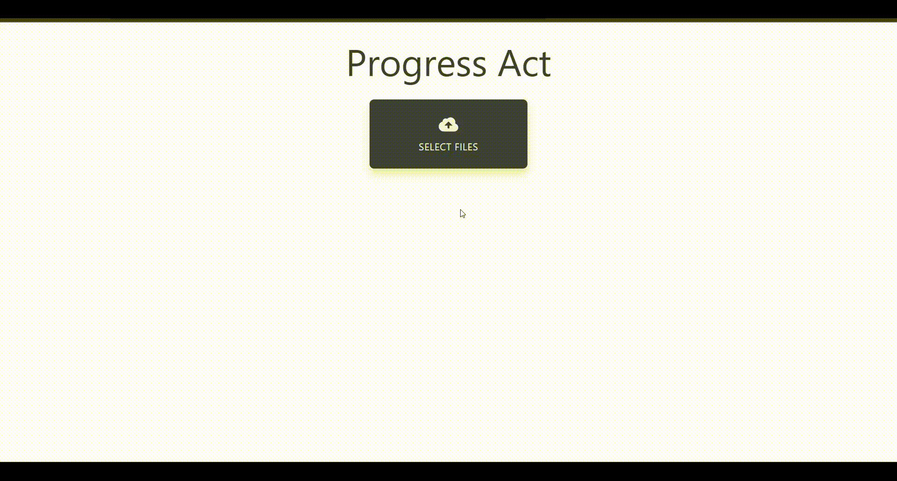

## Progress Act 💈

A web app to upload multiple files asynchronously.

***

#### Built With

- [React.js](https://reactjs.org) - A JavaScript library for building user interfaces.
- [Express.js](http://expressjs.com) - Fast, unopinionated, minimalist web framework for Node.js.
- [Tailwind CSS](https://tailwindcss.com) - A utility-first CSS framework for rapidly building custom designs.

#### Getting Started

- Navigate to Server folder `cd server` and run `npm install && npm start`
- Navigate to Client folder `cd client` and run `npm install && npm start`
